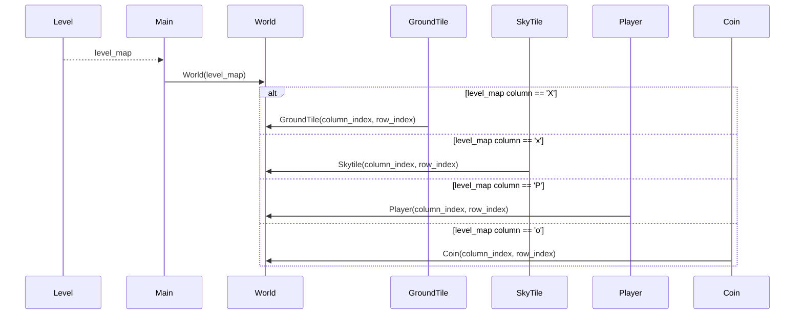

# Application Architecture
## Basic Structure
This is the main structure of the application:

## Setting up the World
Here's a simplified visualization of how the World class uses level maps to set the x & y coordinates of the sprites:

