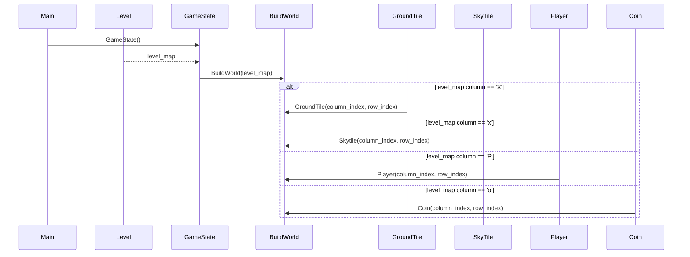

# Application Architecture
This is a simplified description of the application architecture. The diagrams might not include every package, module or a sprite object, but they can be useful for gaining a basic understanding of how the application works.

## Basic Structure
This is the main structure of the application:

- The *main* module sets up the database by using the *db* package and then initializes the game. 
- The *main* module runs the game by using the *GameState* class from the *game_state* module. 
- *GameState* controls what's active – either one of the game menus, the game world, or the finish screen (within the game world).
- *GameState* calls the *BuildWorld* class (from the *build_world* module) to build and run the game world. The level map is stored in a .txt file and fetched using the *Services* package. *GameState* passes the level map to *BuildWorld* as an argument.
- *BuildWorld* sets up the world according to the level map. It uses the *Sprites* package for creating the characters, tiles, coins and so on.

The *main*, *game_state* and *build_world* modules are the main modules of the program. They use *config*, *ui* and *services* packages for operating. The *sprites* package is mostly used by *build_world*. There's also an *assets* package used by the sprites.

## Game State

The application has the following states:

- Main Menu
- Pause Menu
- Win Screen (including the High Scores screens)
- Game Over Screen
- Play

*GameState* uses the *ui* package for the menus and the screens. The win and game over screens are handled by the *FinishScreen* class and the menu classes are located in the *menus* directory. *BuildWorld* is used for the Play state.

## Setting up the World
The level maps are saved as .txt files. The following characters are used to
build the level in the .txt file:

    P = Player
    X = Ground tile
    x = Sky tile
    o = Coin
    e = Enemy
    f = Goal
    
You can take a look at the [level 1 map](https://github.com/ismomehdi/ot-harjoitustyo/blob/main/src/levels/1.txt) to get an idea of how the level is constructed.

Here's a simplified visualization of how the *BuildWorld* class uses level maps to set the x & y coordinates of the sprites:

## Sprites

The *sprites* package contains all the sprites used in the game. The sprites are created using the [pygame's built-in sprite class](https://www.pygame.org/docs/ref/sprite.html#pygame.sprite.Sprite). At the time of writing the following sprites are included:

- Player
- Enemy
- Coin
- GroundTile
- SkyTile
- Goal

The *sprites* rely heavily on the *Collisions* class for the collisions, *assets* package for the images and *AnimateCharacter* / *AnimateObject* classes for the animations. All the aforementioned are included in the *services* directory.

## Camera

*BuildWorld* calls the *Camera* class from the *services* package to render the sprites. *Camera* draws the visible sprites on the display surface so that their position is
manipulated by an offset value. That way a moving camera is achieved; whenever the player moves close to the camera 'borders', the offset position is recalculated and the camera moves. 

## Config

The *config* package contains most of the constants used by other modules (there might still be a few that are yet to be moved to the *config* package). The file/directory paths are also stored in a *.env.public* environment variable.

## Database

The application uses SQlite for storing the High Score data. The *db* package contains all the related data (except the actual database file, which is stored in the project root in the *data* folder):

- The *config* module takes care of the database connection and setting up the tables. It also offers a simple function for reading the SQL files.
- The *HighScoreRepository* class is used for interacting with the high_scores table.

