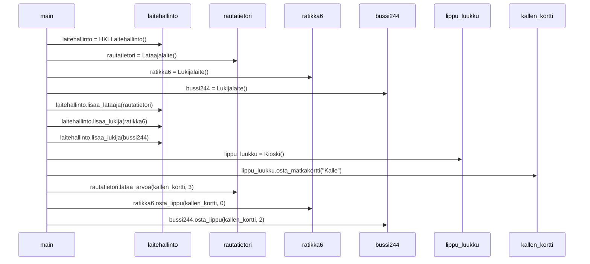

```mermaid

sequenceDiagram
  main->>laitehallinto: laitehallinto = HKLLaitehallinto()
  main->>rautatietori:     rautatietori = Lataajalaite()
  main->>ratikka6:     ratikka6 = Lukijalaite()
  main->>bussi244: bussi244 = Lukijalaite()
  
  main->>laitehallinto:     laitehallinto.lisaa_lataaja(rautatietori)
  main->>laitehallinto: laitehallinto.lisaa_lukija(ratikka6)
  main->>laitehallinto: laitehallinto.lisaa_lukija(bussi244)
  
  main->>lippu_luukku: lippu_luukku = Kioski()
  main->>kallen_kortti: lippu_luukku.osta_matkakortti("Kalle")
  main->>rautatietori: rautatietori.lataa_arvoa(kallen_kortti, 3)
  
  main->>ratikka6: ratikka6.osta_lippu(kallen_kortti, 0)
  main->>bussi244: bussi244.osta_lippu(kallen_kortti, 2)

  


```
